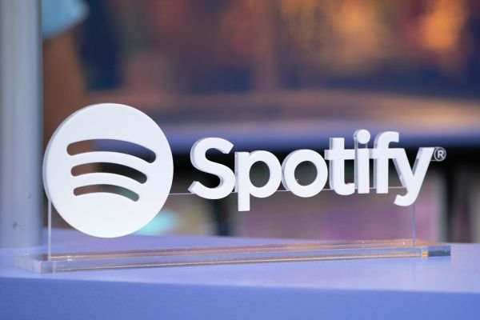
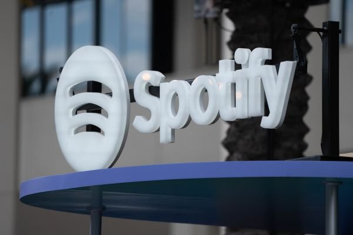

# YouTube, Explained for People Who Just Got Here

You typed "youtube" into a search box. That's it. Maybe you're new, maybe you're a creator who's been uploading for years and wants to understand how the thing actually works. Either way, this is a plain-language field guide to the biggest video site on the planet — what it is, how it works, and the parts that trip people up.

## What YouTube actually is

YouTube is a video-sharing platform owned by Google. People upload videos, other people watch them, and the whole thing is funded by ads, subscriptions, and a revenue-share system that pays creators. It launched in 2005, got bought by Google in 2006, and has been the default video site ever since.

It's not just "the place where videos live." It's:

- A search engine for video (most people use it exactly like Google, but for moving images)
- A social network (comments, likes, community posts, live chat)
- A TV replacement (millions of people watch it on a TV app more than they watch cable)
- A music platform, a podcast host, a live-streaming service, and a place to learn how to fix your sink

The videos are free to watch. The cost is ads, and increasingly, a subscription called **YouTube Premium** that removes ads, lets you play videos in the background, and includes YouTube Music.

## The three sides of YouTube

Understanding YouTube means understanding that it's three different products wearing one coat.

### 1. The viewer side
You watch, you search, you subscribe. The recommendation algorithm decides what you see on the home page and in the "Up Next" sidebar. That algorithm is the real product — it's a machine-learning system that tries to predict what you'll watch next, and it's the reason people say things like "I fell down a YouTube rabbit hole."

### 2. The creator side
Anyone can upload. To make money, you need to join the **YouTube Partner Program**, which requires 1,000 subscribers and 4,000 watch hours in the last 12 months (or 10 million Shorts views in 90 days). Once you're in, you earn a share of ad revenue. Most creators also make money through sponsorships, merchandise, Patreon, and memberships.

### 3. The platform side
YouTube the company decides the rules: what's monetizable, what gets demonetized, what gets removed for policy violations. This is the part creators complain about the most, because the rules are long, the moderation is often automated, and appeals are slow.

## The formats

YouTube now has four main video formats, and they behave differently:

| Format | Length vibe | Where it lives | Best for |
|---|---|---|---|
| Long-form | 5–60 min | Main channel, search | Tutorials, essays, vlogs, documentaries |
| Shorts | Under 60 sec, vertical | Shorts feed | Hooks, trends, quick jokes, discoverability |
| Live streams | Any length | Channel, live tab | Events, gaming, Q&As, premieres |
| Podcasts | 30–120 min | Channel, podcast tab | Conversations, interviews, long talks |

**Shorts** are YouTube's answer to TikTok and Instagram Reels. They're vertical, loop, and get pushed aggressively by the algorithm to people who don't subscribe to you. That's why you'll see channels blow up from one Short even with zero existing audience.

## How the algorithm actually works (the short version)

Nobody outside YouTube knows the exact ranking code. But years of creator data and YouTube's own statements give a decent picture:

- **Click-through rate (CTR)** — how often people who see your thumbnail actually click it. This is why thumbnails matter so much.
- **Average view duration** — how long people watch before leaving. The algorithm wants to know if your video holds attention.
- **Session time** — does your video lead people to watch *more* videos? If yes, YouTube promotes you harder.
- **Satisfaction signals** — likes, shares, comments, "not interested" clicks.

The practical takeaways: make a thumbnail that earns the click, front-load your video so people don't bounce in the first 15 seconds, and don't obsess over the exact algorithm. It changes constantly, and chasing it is a treadmill.

## The things that surprise newcomers

- **Ad revenue is lower than people think.** A common rough number is $1–3 RPM (revenue per 1,000 views) for most niches, before YouTube's cut. Finance and tech videos earn more per view; gaming and vlogs earn less. Don't quit your job based on a viral video.
- **Copyright is the #1 headache.** Content ID automatically scans uploads for copyrighted audio and video. Even playing 10 seconds of a song in the background can get your video claimed, meaning the copyright holder takes the ad revenue. The system is notorious for false claims, and disputing them is a process.
- **Demonetization ≠ deletion.** A video can be "not suitable for all advertisers" and still be watchable. It just earns no money. Swearing, controversial topics, and even some medical content get flagged.
- **YouTube is a search engine first.** Most views come from search and suggested videos, not the home page. This is why titles and descriptions matter — they're how people find you at all.
- **The algorithm punishes burnout.** Uploading daily to "feed the algorithm" is a known path to low-quality videos and burnout. Consistency beats frequency.

## Where the money comes from (for creators)

1. **Ad revenue** — the classic. Split with YouTube, paid out monthly after you hit the $100 threshold.
2. **Channel memberships** — fans pay $0.99–$49.99/month for badges, emojis, and perks.
3. **Super Chat / Super Thanks** — paid messages during live streams and premieres.
4. **YouTube Shopping** — affiliate links and merch sold directly through videos.
5. **Sponsorships** — brands pay you directly. For most mid-size creators, this is the real income, not ads.
6. **Licensing and republishing** — some creators license their videos to TV, news, or other platforms.

## The honest advice

If you're here to start a channel: pick a topic you can talk about for a hundred videos, not one viral hit. The people who "make it" are the ones who survived the first year of single-digit views. The algorithm doesn't owe you anything — it owes you exactly what you earn.

If you're here to understand the site: remember that YouTube is not a video library. It's an advertising business that happens to distribute video. Every design decision — autoplay, suggested videos, the home page — is built to keep you watching, because watching is what sells ads.

That's YouTube. It's a weird, wonderful, frustrating machine, and it's probably not going anywhere.

---

*Photos by Anthony Quintano, VidCon 2022, licensed CC BY. The repo also contains the original files under `assets/`.*